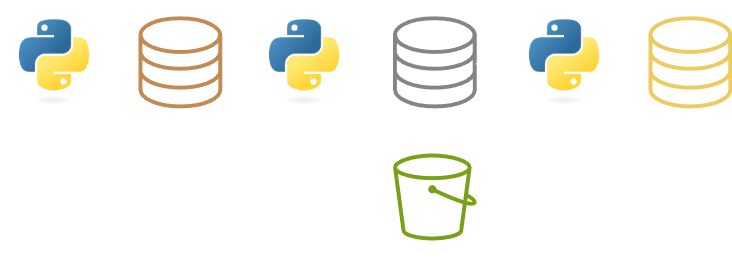

# Pipeline de Dados - Camadas Bronze, Silver e Gold 🏗️

[](https://www.python.org/)
[](https://pandas.pydata.org/)
[](https://aws.amazon.com/s3/)
[](https://python-poetry.org/)

<p align="center">
  
</p>

Este projeto implementa um pipeline de dados completo seguindo a Arquitetura Medalhão (Bronze-Silver-Gold), com geração de dados sintéticos, tratamento de qualidade e análises prontas para a área de negócios.

## Funcionalidades Principais

- **Geração de dados sintéticos** com problemas de qualidade
- **Camada Bronze**: Dados brutos em CSV, com duplicatas e inconsistências
- **Camada Silver**: Dados limpos e normalizados em Parquet
- **Camada Gold**: Conjuntos analíticos prontos para dashboards
- **Integração com AWS S3** para armazenamento em *bucket*, simulando um Data Lake
- **Logs** para tratamento de erros

## Estrutura do Projeto

```bash
.
├── data/                     # Camadas de dados
│   ├── bronze/               # Dados brutos não tratados
│   ├── silver/               # Dados limpos e estruturados
│   └── gold/                 # Dados analíticos processados
├── images/                   # Imagens auxiliares
├── logs/                     # Arquivos de log
├── src/                  
│   ├── pipelines/            # Lógica de processamento
│   │   ├── aggregators.py    # Transformações Gold
│   │   ├── data_generator.py # Geração dados Bronze
│   │   └── processor.py      # Limpeza Silver
│   ├── utils/                # Utilitários
│   │   └── s3_client.py      # Conexão e upload com AWS S3
│   └── main.py               # Orquestração do pipeline
├── .env                      # Configurações sensíveis
├── poetry.lock               # Dependências travadas
└── pyproject.toml            # Configuração do projeto
```

## Configuração Inicial
### 1. Clonar o Repositório
```bash
git clone https://github.com/sch-paulo/s3-medallion.git
cd s3-medallion
```
### 2. Configurar Ambiente
1. Criar arquivo `.env`

2. Preencher com suas credenciais AWS:

```ini
AWS_ACCESS_KEY_ID=SUA_CHAVE_AWS
AWS_SECRET_ACCESS_KEY=SUA_SECRET_KEY
AWS_REGION=SUA_REGIAO
BUCKET_NAME=NOME_DO_SEU_BUCKET
```

3. Instalar Dependências
```bash
poetry install
poetry shell
```

## Executando o Pipeline
```bash
# Execução completa (geração + processamento + upload para o bucket)
python src/main.py

# Ou execute módulos individualmente:
# Geração dados Bronze
python src/pipelines/data_generator.py

# Processamento Silver
python src/pipelines/processor.py

# Geração Gold
python src/pipelines/aggregators.py
```

## Camadas de Dados
### Bronze (Raw)
- Dados brutos com problemas intencionais
- Formato: CSV
- Exemplo: `bronze_layer_raw.csv`

### Silver (Clean)
- Dados tratados e normalizados
- Formato: Parquet
- Exemplo: `silver_layer_clean.parquet`

### Gold (Analytics)
- Métricas prontas para análise
- Conjuntos inclusos:
  - `active_users.csv`: Usuários ativos
  - `time_analytics.csv`: Resumo das informações por mês e ano de inscrição
  - `status_summary.csv`: Métricas para cada status
  - `yearly_growth`: Variação anual de novos usuários
  - `exec_dashboard.csv`: KPIs anuais

## Monitoramento e Solução de Problemas
| Problema              | Recomendação                                               |
|----------------------|------------------------------------------------------------|
| Erros de validação   | Verificar `pipeline.log` e validar dados de entrada        |
| Falha conexão S3     | Checar credenciais no `.env` e permissões do bucket na AWS |
| Performance lenta    | Reduzir volume de dados gerados ou aumentar recursos       |
